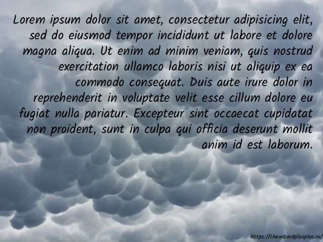

# White Generator

Utility for a generation of memes.

## Features

* a generation of memes (in PNG format);
* a support of plain and graphic backgrounds;
* a specification of a text rectangle;
* a support of horizontal and vertical text alignments;
* a read of memes texts from a file (each text is separated from another by a double newline);
* a support single-line and multiline memes texts;
* a protection against duplicate memes texts (it's optional);
* a support of a watermark (it's optional);
* meme settings:
    * background:
        * color;
        * width;
        * height;
        * image:
            * it supports the same formats as [Pillow](http://python-pillow.org/) library;
            * it'll be resized to the specified size (it's optional);
        * resizing filter;
    * text:
        * font:
            * it supports only TrueType fonts;
            * it's optional (if none, the [Pillow](http://python-pillow.org/) library's default font is used);
        * size;
        * color;
        * left;
        * rigth (if the value is negative, the image width is added to it);
        * top;
        * bottom (if the value is negative, the image height is added to it);
        * horizontal alignment;
        * vertical alignment;
    * watermark:
        * font (it always uses the text font);
        * text;
        * size;
        * color.

## Installation

```
$ pip install white-generator
```

## Usage

```
$ white-generator -v | --version
$ white-generator -h | --help
$ white-generator [options] (-i INPUT_FILE | --input-file INPUT_FILE)
```

Options:

* `-v`, `--version` &mdash; show the version message and exit;
* `-h`, `--help` &mdash; show this help message and exit;
* `-i INPUT_FILE`, ` --input-file INPUT_FILE` &mdash; the path to the file with notes;
* `-o OUTPUT_PATH`, ` --output-path OUTPUT_PATH` &mdash; the path for generated images (default: `output`);
* `-l TEXT_RECTANGLE_LEFT`, ` --text-rectangle-left TEXT_RECTANGLE_LEFT` &mdash; the left text position (default: 0);
* `-t TEXT_RECTANGLE_TOP`, ` --text-rectangle-top TEXT_RECTANGLE_TOP` &mdash; the top text position (default: 0);
* `-R TEXT_RECTANGLE_RIGHT`, ` --text-rectangle-right TEXT_RECTANGLE_RIGHT` &mdash; the horizontal text limit (if the value is negative, the image width is added to it; default: -1);
* `-B TEXT_RECTANGLE_BOTTOM`, ` --text-rectangle-bottom TEXT_RECTANGLE_BOTTOM` &mdash; the vertical text limit (if the value is negative, the image height is added to it; default: -1);
* `-a {left,center,right}`, ` --text-horizontal-align {left,center,right}` &mdash; the text horizontal alignment (default: `center`);
* `-A {top,center,bottom}`, ` --text-vertical-align {top,center,bottom}` &mdash; the text vertical alignment (default: `center`);
* `-W IMAGE_WIDTH`, ` --image-width IMAGE_WIDTH` &mdash; the image width (default: 640);
* `-H IMAGE_HEIGHT`, ` --image-height IMAGE_HEIGHT` &mdash; the image height (default: 480);
* `-b IMAGE_BACKGROUND_COLOR`, ` --image-background-color IMAGE_BACKGROUND_COLOR` &mdash; the image background color (default: `rgb(255, 255, 255)`);
* `-I IMAGE_BACKGROUND_IMAGE`, ` --image-background-image IMAGE_BACKGROUND_IMAGE` &mdash; the path to the background image (default: none);
* `-F {nearest,box,bilinear,hamming,bicubic,lanczos}`, ` --image-resizing-filter {nearest,box,bilinear,hamming,bicubic,lanczos}` &mdash; the resizing filter for the background image (default: `lanczos`);
* `-f TEXT_FONT_FILE`, ` --text-font-file TEXT_FONT_FILE` &mdash; the path to the font file (if none, the Pillow library's default font is used; default: none);
* `-s TEXT_FONT_SIZE`, ` --text-font-size TEXT_FONT_SIZE` &mdash; the font size (default: 25);
* `-c TEXT_FONT_COLOR`, ` --text-font-color TEXT_FONT_COLOR` &mdash; the font color (default: `rgb(0, 0, 0)`);
* `-w WATERMARK_TEXT`, ` --watermark-text WATERMARK_TEXT` &mdash; the watermark text (default: none);
* `-S WATERMARK_SIZE`, ` --watermark-size WATERMARK_SIZE` &mdash; the watermark font size (default: 12);
* `-C WATERMARK_COLOR`, ` --watermark-color WATERMARK_COLOR` &mdash; the watermark font color (default: `rgb(128, 128, 128)`);
* `--no-database` &mdash; don't filter notes by database;
* `--no-resizing` &mdash; don't resize the background image.

## Generated Images




## License

The MIT License (MIT)

Copyright &copy; 2017, 2024 thewizardplusplus
