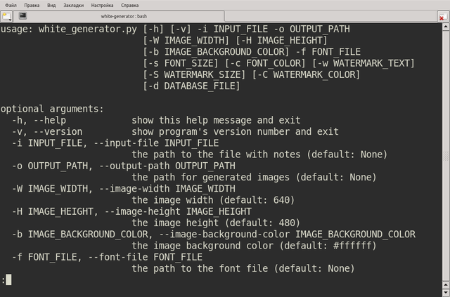
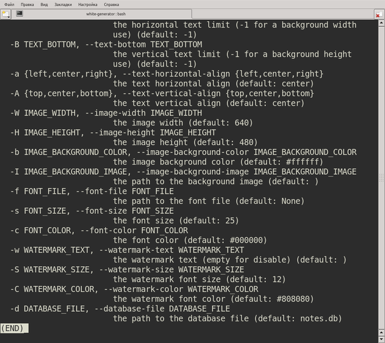
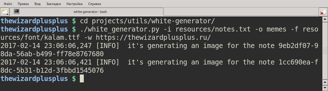
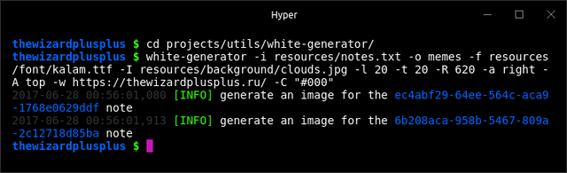

# White Generator

Utility for a generation of memes.

## Features

* a generation of memes (in PNG format) with a plain background and a centric text;
* a read of memes texts from a file (each text is separated from another by a double newline);
* a support single-line and multiline memes texts;
* a protection against duplicate memes texts;
* a support of a watermark (it's optional);
* meme settings:
    * background:
        * color;
        * width;
        * height;
    * text:
        * font (it supports only TrueType fonts);
        * size;
        * color;
    * watermark:
        * font (it always uses the text font);
        * text;
        * size;
        * color.

## Usage

```
$ white_generator.py -v | --version
$ white_generator.py -h | --help
$ white_generator.py [options] (-f FONT_FILE | --font-file FONT_FILE) (-i INPUT_FILE | --input-file INPUT_FILE) (-o OUTPUT_PATH | --output-path OUTPUT_PATH)
```

Options:

* `-v`, `--version` &mdash; show program's version number and exit;
* `-h`, `--help` &mdash; show this help message and exit;
* `-i INPUT_FILE`, ` --input-file INPUT_FILE` &mdash; the path to the file with notes;
* `-o OUTPUT_PATH`, ` --output-path OUTPUT_PATH` &mdash; the path for generated images;
* `-W IMAGE_WIDTH`, ` --image-width IMAGE_WIDTH` &mdash; the image width (default: 640);
* `-H IMAGE_HEIGHT`, ` --image-height IMAGE_HEIGHT` &mdash; the image height (default: 480);
* `-b IMAGE_BACKGROUND_COLOR`, ` --image-background-color IMAGE_BACKGROUND_COLOR` &mdash; the image background color (default: `#ffffff`);
* `-f FONT_FILE`, ` --font-file FONT_FILE` &mdash; the path to the font file;
* `-s FONT_SIZE`, ` --font-size FONT_SIZE` &mdash; the font size (default: 25);
* `-c FONT_COLOR`, ` --font-color FONT_COLOR` &mdash; the font color (default: `#000000`);
* `-w WATERMARK_TEXT`, ` --watermark-text WATERMARK_TEXT` &mdash; the watermark text (empty for disable; default: empty);
* `-S WATERMARK_SIZE`, ` --watermark-size WATERMARK_SIZE` &mdash; the watermark font size (default: 12);
* `-C WATERMARK_COLOR`, ` --watermark-color WATERMARK_COLOR` &mdash; the watermark font color (default: `#808080`);
* `-d DATABASE_FILE`, ` --database-file DATABASE_FILE` &mdash; the path to the database file (default: `notes.db`).

## Screenshots



Help message, part 1



Help message, part 2



Generation of images



Generated image

## License

The MIT License (MIT)

Copyright &copy; 2017 thewizardplusplus
